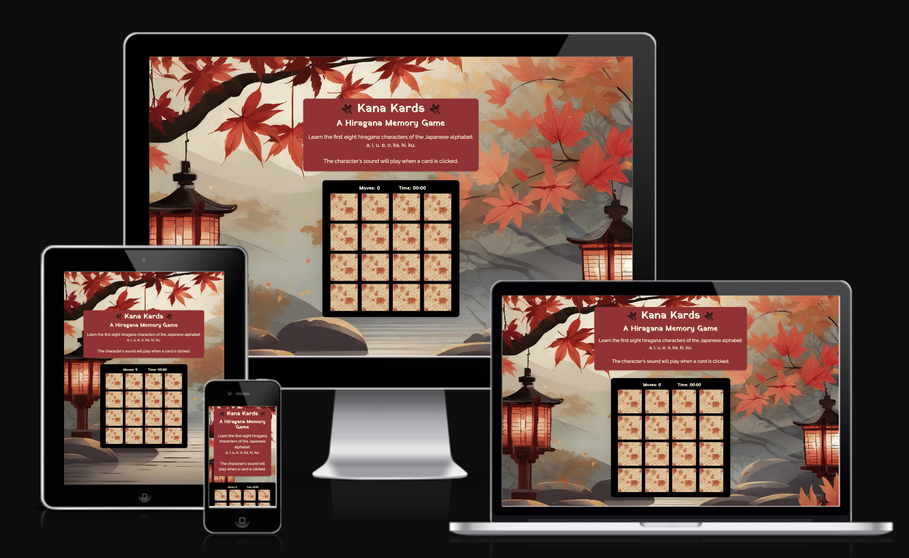

# Kana Kards

[View live project here on GitHub](https://laurachri-hall.github.io/kana-kards/)

**Kana Kards** is a learning tool for memorising hiragana, one of the basic Japanese alphabets. It utilises a basic memory game and sound to help learners associate the correct character with its sound. It's target audience is anyone wanting to begin to learn how to read Japanese. 

   
  

---

## CONTENTS  
  
* [UXD (User Experience Design)](#user-experience-ux)
  * [User Stories](#user-stories) 
* [Creation process (Strategy -> Surface)](#creation-process)
  * [Wireframes](#wireframes)
* [Design](#design)
  * [Colour Scheme](#color-scheme)
  * [Typography](#typography)
  * [Imagery](#imagery)
* [Page Features](#page-features)
  * [Navbar](#navbar)
  * [Hero-Image](#hero-image)
  * [Tagline & Call to Action](#tagline--call-to-action)
  * [Business Ethos](#business-ethos)
  * [Menu Page](#menu-page)
  * [Contact Page](#contact-page)
  * [Footer](#footer)  
* [Tablet & Mobile View](#tablet--mobile-view)
  * [Desktop, Tablet & Mobile Differences](#desktop-tablet--mobile-differences)
  * [Tablet View](#tablet-view-ipad-miniipad-prosurface-pro)
  * [Mobile View](#mobile-view-iphone-5iphone-seiphone-xriphone-12-pro)
* [Future Features](#future-features)
* [Technologies Used](#technologies-used)
  * [Languages Used](#languages-used)
  * [Frameworks, Libraries, Technologies & Programs Used](#frameworks-libraries-technologies--programs-used)
* [Deployment](#deployment)
  * [How to deploy](#how-to-deploy)
* [Testing](#testing)
  * [HTML Validation using W3C Validation](#html-validation-using-w3c-validation)
  * [CSS Validation using W3C Validation](#css-validation-using-w3c-validation)
  * [Lighthouse scores via Chrome Developer Tools](#lighthouse-scores-via-chrome-developer-tools)
  * [Bugs & Fixes](#bugs--fixes)
  * [Unsolved Bugs](#unsolved-bugs)
* [Credits](#credits) 

  
---    

## User Experience (UX)  
  
### **User Stories**  

### **Primary Goal**  
  
Kana Kards is a simple game with the sole purpose of helping learners of Japanese practise reading basic kana characters.

### **Visitor Goals** 
Visitors to Kana Kards can engage with the memory game to help them memorise characters and associate the charater's sound with the image. 

### **First Time Visitor**
  - A user can read the short introduction to the website to understand the purpose of the site.
  - A user can click on a card, the cards will flip over and the the user will hear the sound the character makes. 
  - If a user has an incorrect match the cards will shake, providing feedback that these cards do not match.
  -If a match is correct the cards will remain face up until the game resets.
  -Once the first two cards are selected the timer will start and reset once the game is finished.
  - Once the first two cards are selected the move counter will begin to track moves and reset once the game is finished.
  -The game will automatically reset when all cards have been matched.

### **Returning Visitor**  
  - A returning visitor can continue to review what they have learned by playing through the game.
  
### **Frequent Visitor**  
  - Same as above.  

--- 

## Creation Process  
  
### **1. Strategy**  

- I required a simple website that helped learners of Japanese to learn and then practise how to read hiragana characters.
- I wanted the sound to link to the character to embed this in the learners mind without the need for a translation into the English alphabet (romaji).
- I wanted a relaxing autumn theme that matched the time of year and links to Japan's cultural pride in its four seasons. 
  

### **2. Scope**  

Kana Kards need to be responsive on a range of devices to allow it to be accessed anytime, anywhere a learners has moment and wants to practise. 

- The site needed to also make use of JavaScript with a minimum of two DOM interactions. 
  

### **3. Structural**  

I wanted the design to be minimal and no fuss, with the focus solely on the learning.
 
- Key information and instructions are seen first with the game underneath.

  
### **4. Skeleton**  

On top of the basic structure, the site was developed to make use of JavaScript to make the game functional.

- Cards flipped over when clicked and then played the correct sound.
- Cards shake to provide user feedback when a match is incorrect before flipping back over.
- A moves counter and timer provide different ways for a user to challenge themselves and improve. 
- The game automatically resets when all matches have been made.

### Wireframes  

Wireframe - Homepage Desktop & Mobile
  

### **5. Surface**  

 A design was created that allowed a easy access to game play.

- A palette of autumn colours and the red and black used in Japanese lacquers to give it a "Japan" feel.
- Two sans-serif fonts, were used 'Yatra One' and 'Raleway'. The former was used to add to the Japanese theme and the latter was picked for readability.

 
 ## Design  

### **Color Scheme**  

This website used a palette of autumn colours found in the background. I also made use of #9d2933, a red shade that is used frequently seen in Japan and also black, that is reminisecent of Japanese black lacquer.
   
   
[Adobe Color](https://color.adobe.com/create/color-contrast-analyzer) checked how accessible the colours are. Orignally, I was using black text but this failed the tests and I switched to using beige for better contrast. 

### **Typography**  
  
[Google Fonts](https://fonts.google.com/) was used to import the fonts 'Yatra One' and 'Raleway'. I used Yatra One for headings and a more 'Japanese' flavour. Raleway was used for the main content and clarity.
  
### **Imagery**  

## Tablet & Mobile View  
 
### **Desktop, Tablet & Mobile Differences**  

To ensure responsivity I used Bootstrap 4.6. All elements resize and wrap as necessary, with everything appearing in a column for smaller screens. The header navbar and logo changed as detailed above.
  

---  

## Future Features  

- For future development, I would like to include a way for members to add what games they have so it is viewable to other members, who then have the option to request a game at a specific club meeting.

## Technologies Used    

### **Languages Used**   

- HTML5
- CSS3

### **Frameworks, Libraries, Technologies & Programs Used**  

- Balsamiq - used to create wireframes and edit images 
- GitHub - used to save and store all files for this website  
- Git - used for version control
- Google Fonts - fonts were imported from here 
- Iconify Design - icons and their associated kit were downloaded from here when Font Awesome enraged me 
- Adobe Color - for all color palettes and accessibility contrast ratios  
- logo.com - for shield favicon  
- Photoshop - to resize and edit images
- Adobe Stock - for main hero image
- Adobe Firefly - for additional AI generated images
- ChatGBT - for club name and all text
- Google Dev Tools - to debug and for testing responsiveness 
- Google Lighthouse - for auditing the website
- W3C Validator - for validating the HTML and CSS code 

---   

## Deployment

### **How to deploy**  

GitHub was used to deploy the website. These were the steps taken to acheive this:  

1. Login to GitHub account
2. Navigate to the project repository, project-1-safeguarding-bgg
3. Click the Settings button near the top of the page
4. In the left-hand menu, find and click on the Pages button
5. In the Source section, choose 'main' from the drop-down, select branch menu
6. Select 'root' from the drop-down folder menu
7. Click 'Save' and after a few moments the project will have been made live and a link is visible at the top of the page

### **Initial testing plan**

I had planned for this site to be accessible and legible on all screen sizes. I used Chrome Dev Tools to test, tweak and debug in the early stages. I deployed my site halfway through to test on real-world devices. These devices included:  
- MacBook Air (1920 X 1080)  
- KOORUI 24 Inch FHD Monitor
- iPad Air 2023
- iPhone 14 Plus
- iPhone 15

### **Testing**    

Testing took place throughout the entire build using Dev Tools on Chrome and on the above real-world devices. The browsers used were:  
- Chrome   
- Safari  

OTHER TESTING STUFF?!?!

### **HTML Validation using W3C Validation**  

Index/landing page HTML validation
  

   

Menu page HTML validation
  

  

Contact page HTML validation
  

  
  
   

### **CSS Validation using W3C Validation** 

SCOOPS CSS validation
  

   

   

## Credits  
  
### **Content References**
- All content written for the website is by myself, is purely fictional, and for educational purposes only.
- [Code Institute](https://codeinstitute.net/ie/) for their HTML/CSS learning material and 'content zoom' module in the Love Running project.
- [W3Schools](https://www.w3schools.com/) for additional learning material and help with bootstrap cards.
- [MDN Web Docs](https://developer.mozilla.org/en-US/docs/Learn/CSS/CSS_layout/Flexbox) for flexbox tutorials and guidance.
- Amy from Code Institute for helping me with the centering the navbar toggle on mobile view and all additional help.
- [StackOverflow](https://stackoverflow.com/questions/66564503/wrong-validation-on-element-br-in-ul-li-elements) guidance on margin issues 
- [Bootsnip](https://bootsnipp.com/snippets/7nmOW) for bootstrap contact form component
- [NSPCC](https://www.nspcc.org.uk/) Design layout inspired by NSPCC homepage.

### **Media References**  
  
- [Adobe Stock](https://stock.adobe.com/) for the hero image. Credit to graphic designer: Macrovector.
- Adobe Firefly for generating all other images with AI.
- [Iconify Design](https://iconify.design/) for all the icons used in this site.
- [logo.com](https://logo.com/dashboard/your-logo-files) for the favicon used for this site.
- [Hotpot.ai](https://hotpot.ai/icon-resizer) for resizing the favicons used for this site.

### **Acknowledgements** 
- I would like to acknowledge my Code Institute facilitator, Amy Richardson, for her calming presence and advice.
- My family and friends for testing my work and offering positive feedback and the invaluable OAP perspective. 
-Shout out to Tayla Ball for keeping me sane and checking in with me.
-Rowan, the dog, for being available for cuddles when needed.